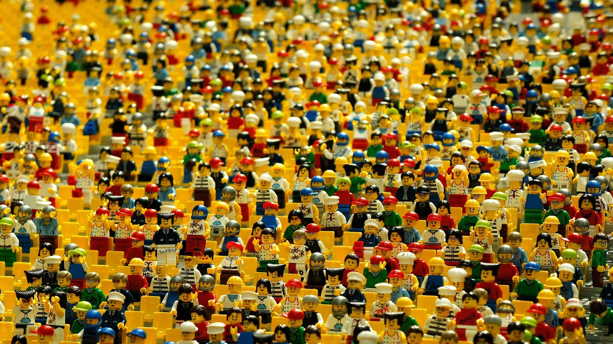
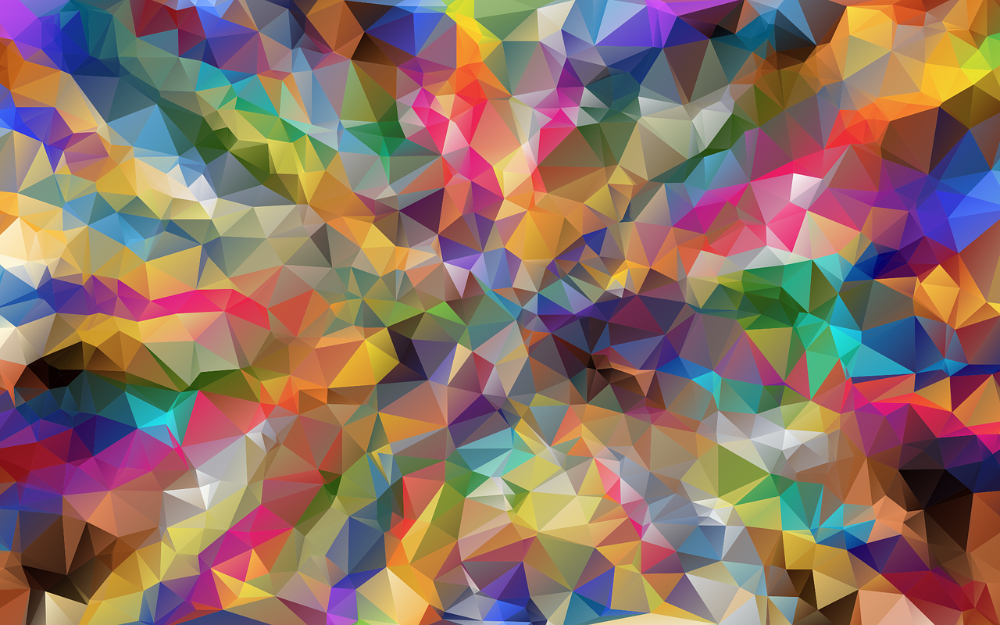
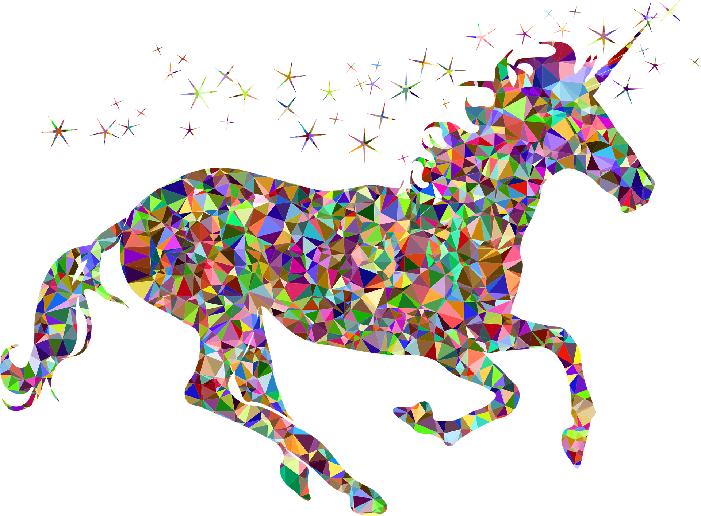

# 2.1. 어른이+어린이=?

**\#키덜트\(Kidult\)**란 어린이와 어른의 합성어^신조어^로서, '어린이와 같은 감성과 취향을 지닌 어른' 또는 어른들이 어린이의 환성을 담은 문화 형식을 뜻합니다. 사실 2000년대 초반 ‘키덜트’란 말이 처음 등장했을 때만 하더라도 '성숙하지 못한 어른', '철없는 아빠' 등 부정적인 늬앙스가 짙게 담겨 있었습니다.

**\#키덜트\(Kidult\)**란 어린이와 어른의 합성어^신조어^로서, '어린이와 같은 감성과 취향을 지닌 어른' 또는 어른들이 어린이의 환성을 담은 문화 형식을 뜻합니다. 사실 2000년대 초반 ‘키덜트’란 말이 처음 등장했을 때만 하더라도 '성숙하지 못한 어른', '철없는 아빠' 등 부정적인 늬앙스가 짙게 담겨 있었습니다.

하지만, 요즘에는 **\#게임**, **\#장난감**, **\#피규어** 등 아이들의 전여물로만 여겨지던 것들에서부터 **\#영화**, **\#만화**, **\#패션**, **\#예술** 등 거의 모든 **\#생활문화** 영역에서 어린이와 어른의 경계선이 사라지는 현상을 일상적으로 쉽게 목격할 수 있습니다.

유치할 정도로 천진난만하고, 재미있는 것을 추구한다는 점에서, 그리고 건전한 취미생활로 즐기는 다양한 모습들로 인해 최근에는 이를 긍정적으로 바라보는 시선이 많아지고 있습니다.

언젠가 지역에서 주관하는 메이커페어를 둘러본 적이 있는, 그때 목격한 것은 급변하는 시대의 **\#혁명적\_순간**이라기 보다는 **\#4차원**적인 **\#천진함**과 **\#천연덕스러움**이었습니다. 일종의 키덜트스러움이었습니다.

당시 주목했던 한 부스는 아이와 아빠가 함께 운영 중이었고, 무엇을 보여주고자 하는지를 전혀 가늠할 수 없는 **\#엉망진창**과 **\#오작동**, **\#실패**, 그리고 **\#아이의\_창피함**과 **\#아빠의\_진지함**이었습니다. 아빠가 상처받을까봐 물어보진 못했지만, 누가보더라도 그 아이는 아빠 손에 끌려 나온 것도 귀찮은데 눈 앞에 펼쳐진 **\#파국**을 두고서 **\#아연질색** 하고 있는 것이 자명하였습니다.

언젠가 그러한 황망한 순간이 이곳 경기도어린이박물관에도 찾아오길 간절히 염원하며, 앞으로의 **\#위대한\_여정**을 시작해 보도록 하겠습니다.

## \*\*\*\*

