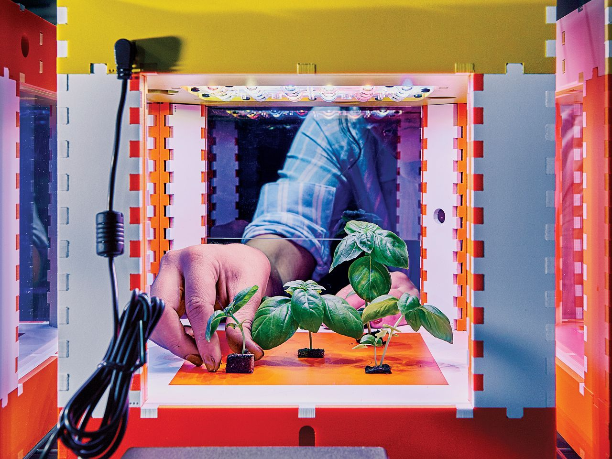

# 5. 식물과의 대화

이 글에서 식물과의 대화를 하는 방법을 엔지니어링과 예술의 시각에서 바라보기 위한 프로젝트이다. 식물을 한번이라도 키워본 사람들은 아마도 알것이다. 식물이란 신기하게도 관심과 관리를 기울지 않으면 금방 시들어 버리고 잘 자라지 않는다. 시들어가는 식물을 보고 있으면 우리의 마음도 역시 시들어가고 있는 것 같다. 필자도 식물을 좋아해서 집에도 여러 식물들을 키우고 있다. 그러다 문득 식물들도 우리와 대화가 필요하지 않을까?라는 생각이 들었다. 시들어가기전에 자신의 상태를 우리에게 알려주면 좋지 않을까? 라는 생각을 했다.

우리가 주위의 사람들과 대화 하듯이, 식물 역시 사실 수많은 주위 환경들과 대화를 하고 있지만 우리는 그걸 눈치채지 못한다. 왜냐하면 그 대화 또는 변화가 우리의 시점에서는 굉장히 느리고 천천히 진행되기 때문에 인간의 인지 영역을 벗어나 있기 때문일 것이다.

식물이 시들어가기 전에 식물은 신호들을 보내고 있다. 식물을 잘 자라는 환경은 이미 많이 알려져 있다. 땅의 습도, 온도, CO2 농도, 물과 토양의 PH 농도 , 빛의 세기, 양분등이 식물이 잘 자라는 변수일 것이다. 그 요소들을 관리해주고 식물을 상태를 매일보면서 식물과 대화하면 자연히 식물을 잘 자란다. 식물을 잘 키우는 법이 궁금하다면 오픈튜토리얼스의 내맘대로 가드닝을 참조하면 좋을 것 같다.

그렇다면 어떻게 해야 할까. 필자의 생각은 누구나 따라할수 있는 열려있는 기술을 이용해서 식물이 우리에게 자신의 환경을 알리 수 있는 스피커를 만들어주고 싶다. 우리가 식물에 계속 관심을 주는 것은 사실 의지로는 힘들 수 있다. 왜나면 우리는 너무 복잡한 세상에서 살고 있기 때문에 식물이 먼저 우리에게 대화를 걸어오면 어떨까? 라는 생각을 했다.

### 5.1. Personal Food Computer

현재 미국의 MIT 미디어랩에서는 **\#OpenAg** 라는 프로젝트로 이와 비슷한 프로젝트를 진행 중이며, 이를 오픈소스로 대중에 공개하고 있다. 이를 통해, 사람들은 식물이 커나가는 모습을 컴퓨터를 이용해서 관리하고 기록하고 그 사진을 보고 있으면 아름답고 나만의 예술작품이 만들어질 수 있다는 것을 알 수 있다.

 하지만, 이 프로젝트는 오픈되어 있어도 한국의 실정에 맞지 않은 부품과 조금은 필요없고 과한 엔니지어링으로 구성되어 있으며, 한국에서는 이 프로젝트를 받아서 실행하기가 쉽지 않다. 재료의 구입 그리고 자료가 영어로 되어 있어 공개된 자료 있지만 사전 지식 없이 따라서 만들기는 만만하지 않은 프로젝트 일 것이다.

따라서, 본 튜토리얼에서는 기존의 프로젝트를 일부 참조만 하고, 일반인이 좀더 쉽게 접근할 수 있고 부품 수급 등에 있어서 우리나라의 실정에 맞추어 적용할 수 있는 방안을 안내하고자 하였다. 더불어, 나만의 식물컴퓨터를 만드는 과정을 통해서 엔지니어링과 그 모습을 관찰하고 기록하는 형태를 통해, 다양한 교육적 경험을 제공하는 데 그 목적이 있다.

컴퓨터와 센서, 통신, 데이타베이스가 무엇인지 알고 그것들을 이용하는 법과 기술들을 조합하여 우리의 생각을 반영하는 식물 스피커를 만드는 방법을 소개하고, 습도, 온도, CO2 농도, PH 농도 , 빛의 세기, 양분을 모니터링하는 시스템을 개발하는 방법을 다룰 것이다.

### 관련 자료 링크

* [내맘대로 가드닝](https://opentutorials.org/course/2304)
* [OpenAg - Personal Food Computer](https://www.media.mit.edu/projects/personal-food-computer/overview/)
* [Kahn, Howie. "Perfecting Crops With AI-Powered Indoor Farms", THE WALL STREET JOURNAL, 2018.10.17.](https://www.wsj.com/articles/perfecting-crops-with-ai-powered-indoor-farms-1539787501)

